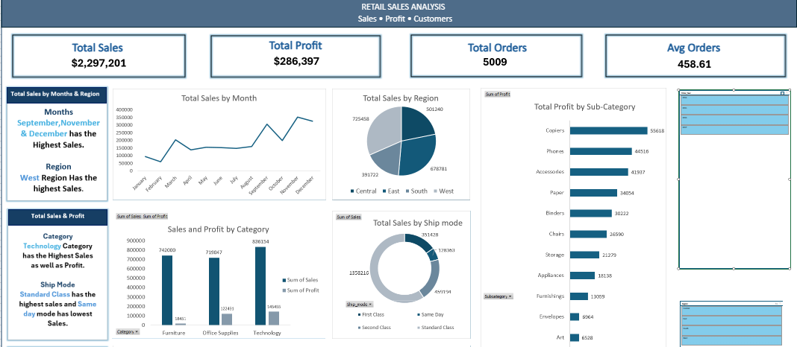

# 📊 Retail Sales Analysis

A data analysis project using **SQL and Microsoft Excel** to analyze retail sales performance and create an interactive dashboard.

## 🛠️ Tools Used

* SQL
* Microsoft Excel
* PivotTables & PivotCharts
* Slicers & Timeline

## 📌 Analysis

* Total Sales
* Total Profit
* Total Orders
* Average Order Value
* Sales by Region
* Sales by Category
* Time-based Sales Trends

## 📂 Files

* `Excel/` – Interactive Excel dashboard
* `SQL/` – SQL analysis queries
* `Dataset/` – Retail dataset
* `images/` – Dashboard preview

